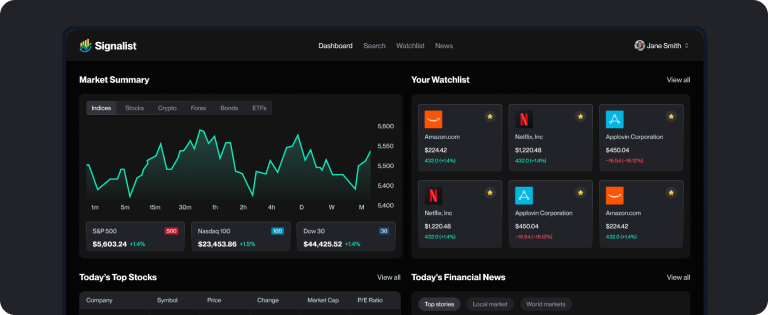

<div align="center">
  <br />
  
  <br /><br />

  <h1>📈 TradePulse</h1>
  <p><strong>Next-Gen Real-Time Stock Tracker, Paper Trading Platform & AI Financial Intelligence Suite</strong></p>

  <div>
    
    
    
    
    
    
    
    
  </div>
</div>

<br />

---

## 🌟 Overview

**TradePulse** is a modern, full-stack financial application built for active investors and traders. It combines **real-time market data**, interactive **TradingView** technical charting, simulated **Paper Trading ($100,000 virtual portfolio)**, and **Google Gemini 1.5 Flash AI** to provide instant stock sentiment, head-to-head asset comparisons, and an interactive financial copilot.

---

## ✨ Key Features

| Feature | Description |
| :--- | :--- |
| 📊 **Interactive Market Dashboard** | Real-time global market quotes, market overview, sector heatmaps, and top financial news powered by TradingView. |
| 🤖 **AI Financial Copilot** | Context-aware floating AI Assistant powered by Google Gemini 1.5 Flash to answer questions, analyze balance sheets, and suggest investment strategies. |
| 🎯 **AI Sentiment & News Analyst** | Instant 0–100 sentiment score, bullish/bearish outlook, key growth catalysts, and risk factors for any ticker. |
| 💵 **$100,000 Paper Trading Simulator** | Real-time virtual portfolio with Buy/Sell order execution, live P&L tracking, cash balance management, and full trade ledger history. |
| ⭐ **MongoDB Cloud Watchlist** | Add and manage favorite stocks with live price streaming, daily percentage change badges, and 1-click trade modals. |
| 🔍 **Multi-Sector Stock Screener** | Filter stocks across Technology, Finance, Healthcare, Energy, and Consumer sectors with Market Cap categories (Mega/Large/Mid Cap). |
| ⚖️ **Head-to-Head Stock Comparison** | Side-by-side metric comparison matrix and Gemini AI quantitative comparative thesis. |
| 📬 **Automated News Digest Crons** | Event-driven background email workflows with Inngest and Nodemailer delivering personalized AI market summaries. |

---

## 🛠️ Tech Stack & Architecture

- **Frontend**: Next.js 15.5.2 (App Router, Server Components & Server Actions), React 19, TailwindCSS 4, Lucide Icons, Shadcn UI
- **Backend & Database**: MongoDB Atlas via Mongoose 8 & MongoDB Native Driver
- **Authentication**: Better Auth 1.3.7 with MongoDB adapter and cookie session persistence
- **Artificial Intelligence**: Google Gemini AI (`gemini-1.5-flash`) via `@google/generative-ai`
- **Market Data APIs**: Finnhub Stock API & TradingView Widgets
- **Background Jobs**: Inngest Serverless Workflows & Scheduled Cron Jobs
- **Email Delivery**: Nodemailer with HTML templates and Gmail SMTP

---

## 🚀 Quick Start (Local Setup)

### 1. Clone the Repository
```bash
git clone https://github.com/saurabh28102006-pixel/tradepulse-stock-tracker.git
cd tradepulse-stock-tracker
```

### 2. Install Dependencies
```bash
npm install
```

### 3. Setup Environment Variables
Create a `.env` file in the root directory:
```env
NEXT_PUBLIC_APP_URL=http://localhost:3000

# Better Auth
BETTER_AUTH_SECRET=your_secret_key_here
BETTER_AUTH_URL=http://localhost:3000

# MongoDB Atlas
MONGODB_URI=mongodb+srv://<username>:<password>@cluster0.bsoubcb.mongodb.net/signalist?retryWrites=true&w=majority

# Finnhub Stock API
FINNHUB_API_KEY=your_finnhub_api_key
NEXT_PUBLIC_FINNHUB_API_KEY=your_finnhub_api_key

# Google Gemini AI
GOOGLE_GEMINI_API_KEY=your_gemini_api_key
GEMINI_API_KEY=your_gemini_api_key

# Inngest Serverless Workflow
INNGEST_EVENT_KEY=your_inngest_event_key
INNGEST_SIGNING_KEY=your_inngest_signing_key

# Nodemailer (Gmail SMTP)
NODEMAILER_EMAIL=your_email@gmail.com
NODEMAILER_PASSWORD=your_gmail_app_password
```

### 4. Run Development Server
```bash
# Terminal 1: Start Next.js App
npm run dev

# Terminal 2: Start Inngest Dev Server
npx inngest-cli@latest dev
```

Open [http://localhost:3000](http://localhost:3000) in your browser.

---

## 🚢 Deployment Guide (Deploying to Vercel)

### Step 1: Push Code to GitHub
Follow the instructions below to push this repository to your GitHub account.

### Step 2: Import into Vercel
1. Go to [vercel.com](https://vercel.com) and click **"Add New Project"**.
2. Select your `tradepulse-stock-tracker` GitHub repository.
3. In **Environment Variables**, add all keys from your `.env` file.
   - Update `NEXT_PUBLIC_APP_URL` and `BETTER_AUTH_URL` with your production Vercel domain (e.g. `https://tradepulse.vercel.app`).
4. Click **Deploy**.

### Step 3: Connect Inngest Cloud
1. Create a free account at [inngest.com](https://www.inngest.com).
2. Create an App named `tradepulse`.
3. Add Inngest Webhook URL: `https://your-vercel-domain.vercel.app/api/inngest`.
4. Copy production Event Key & Signing Key to your Vercel Environment Variables.

---

## 📜 License
This project is open-source and available under the [MIT License](LICENSE).